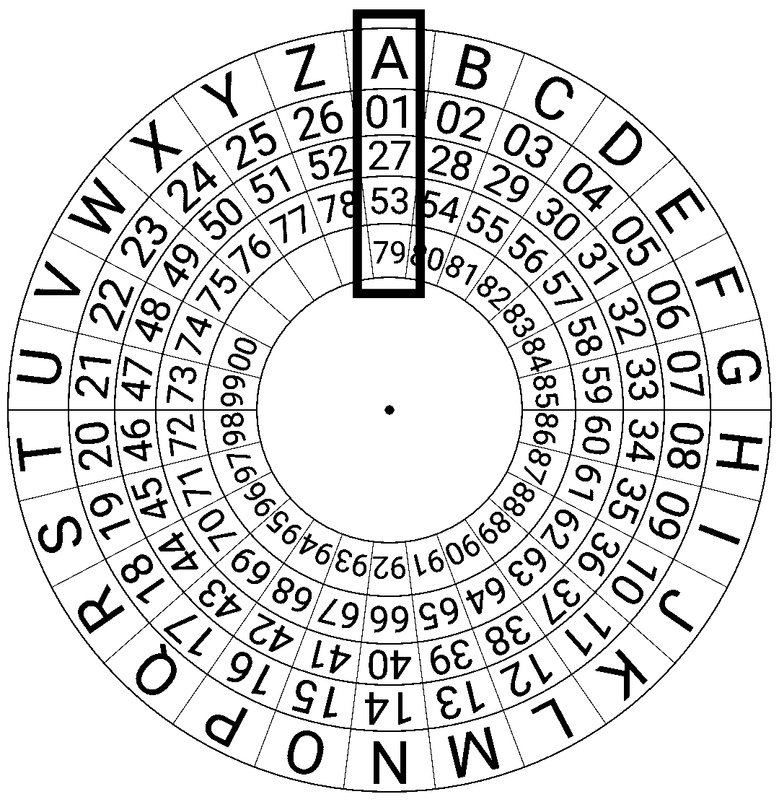

### Ciphers

 

This is a package in Rust that implements basics encryption algorithms. Details on the the algorithms implemented can be found in this [book](http://inventwithpython.com/cracking/). Here is the complete list of algos and their respective status of implementation.

| Name                   	| status     	|
|------------------------	|------------	|
| Caesar cipher          	|    done    	|
| Transposition Cipher   	|    done   	|
| File encrypting        	| to be done 	|
| Affine Cipher          	| to be done 	|
| Simple Substitution    	| to be done 	|
| Vigenère Cipher           |     done  	|
| One-time Pad Cipher    	| to be done 	|
| Generate Prime Numbers 	| to be done 	|
| Public Key Cipher      	| to be done 	|

### Dependencies

num-traits = "0.2.14"